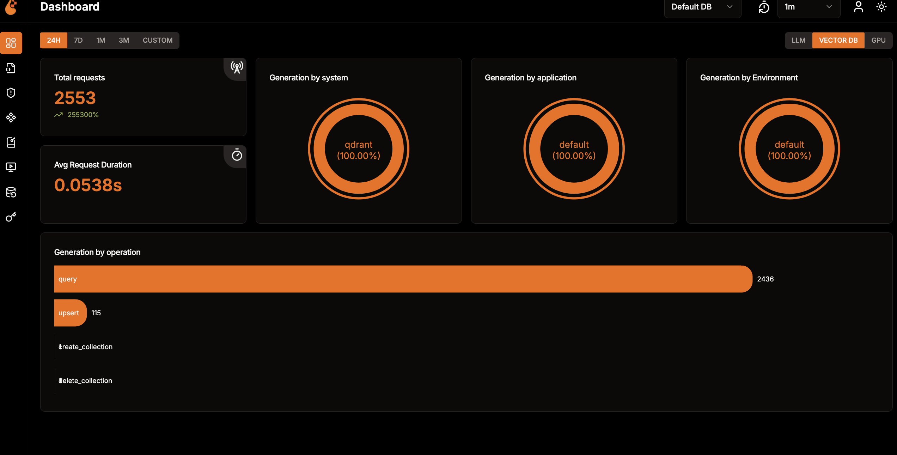

# Milvus-Qdrant Benchmark 🔍

A comprehensive toolkit for benchmarking Milvus and Qdrant vector databases using Locust as a load testing tool. The project focuses on comparing performance with hybrid search (dense and sparse vectors) using the BGE-M3 model.

## Disclamer

This project is a work in progress. It is not ready for production use. It is a proof of concept to compare the performance of Milvus and Qdrant with hybrid search.
Qrant is currently tested  with other dataset, u may have to change the code to use videogame dataset.

## Features 🌟

- Hybrid search benchmarking (dense + sparse vectors)
- BGE-M3 embeddings generation
- Provide observability with openlit
- Detailed performance metrics with locust
- Docker-based deployments for all tool

## How it works

- download a dataset (u can use from videogame directory)
- prepare the dataset to get jsonl (you mave have to modify the prepare-dataset-hf.py to get the correct format)
- insert the dataset into milvus and qdrant
- run the benchmark with locust
- check the results with openlit

## Quick Start 🚀

### Prerequisites

- Python 3.11
- pip
- task
- pipenv
- Docker and Docker Compose

### Installation

```bash
 

# Install dependencies
task bootstrap
```

### Environment Setup

```bash
# For Milvus
export MILVUS_HOST=localhost
export MILVUS_PORT=19530

# Start databases
task start-milvus  # For Milvus
task start-qdrant  # For Qdrant
```

## Project Structure 📂

```text
.
├── data/videogame            # Data files exmaple for videogame
│   ├── dataset.csv           # Source original dataset
│   ├── questions.txt         # pre generated question for the dataset
│   └── testset.json         # Processed queries
├── openlt/                    # Openlit configuration

│   ├── prepare_dataset*.py    # Dataset processing
│   └── prepare_custom_query*.py # Query preparation (if you want to generate it)
├── milvus/                   # Milvus configuration
└── qdrant/                   # Qdrant configuration
```

## Data Preparation 🛠️

1. Extract dataset:

```bash
task prepare-data
```

2. Process dataset:

```bash
python tools/prepare_dataset.py
```

3. Prepare queries:

```bash
# For Milvus
python tools/prepare_custom_query-milvus.py generate_testset

# For Qdrant
python tools/prepare_custom_query-qdrant.py generate_testset
```

## Running Benchmarks 📊

1. Start Locust example:

```bash
locust -f benchmark_locust_milvus.py --host http://localhost:19530
```

2. Access UI at `http://localhost:8089` and configure:
   - Number of users
   - Spawn rate
   - Host URL

3. Available tests:
   - Dense vector search
   - Sparse vector search
   - Hybrid search
   - Bulk insertions
   - Metadata queries

### locust interface


### openlit interface



### Test Execution 🏃

1. Start Locust for Milvus:

```bash
locust -f benchmark_locust_milvus.py --host http://localhost:19530
```

2. Access Locust Web Interface:
   - Navigate to `http://localhost:8089`
   - Configure test parameters:
     - Number of users: simulated user count
     - Spawn rate: user creation rate
     - Host: Milvus instance URL

3. Available Metrics:
   - Response times (min, max, average)
   - Requests per second
   - Error rate
   - Response time distribution

### Test Customization 🎛️

To modify test scenarios:

1. Edit queries in `questions.txt`
2. Adjust parameters in `common.py`:

```python
# common.py
DIMENSION = 1024      # BGE-M3's dense vector dimension
VOCAB_SIZE = 250002   # BGE-M3's vocabulary size
COLLECTION_NAME = "games"
DATABASE_NAME = "gamedb"
```

### Tools Features

- Dataset processing:
  - Chunk size: 500 entries
  - BGE-M3 embeddings
  - Dense and sparse vectors

- Hybrid search weights:
  - Sparse: 0.45
  - Dense: 0.55

## Task Automation 🤖

```bash
task
task: [default] task --list
task: Available tasks for this project:
* bootstap:              Bootstrap the environment
* build:                 Build Docker image
* check-qdrant:          Check the qdrant colletion
* default:               List available tasks
* download-hf-ds:        Download the dataset from huggingface
* extract-gz-data:       extract the data
* init-db-milvus:        Initialize the database
* init-db-qdrant:        Initialize the database qdrant
* prepare-data-hf:       Prepare the dataset before insert
* shell:                 load python shell
* start-milvus:          Run the milvus stack
* start-openlit:         Run the openlit stack
* start-qdrant:          Run the qdrant stack
* stop-milvus:           Stop the milvus stack
* stop-qdrant:           Stop the qdrant stack
```

## Contributing 🤝

Contributions are welcome! Feel free to:

- Open issues
- Submit pull requests
- Improve documentation
- Add new features

## License ⚖️

MIT
